# No-Due Portal — Role-Based Student Clearance Workflow

A full-stack college clearance platform built with Django REST Framework and React. The system guides students through an 11-section no-due workflow and routes verification requests to the appropriate institutional roles.

## Screenshots

### Landing & Login
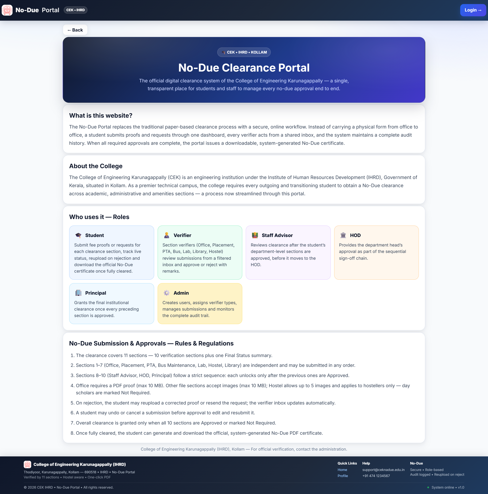
*Landing page*

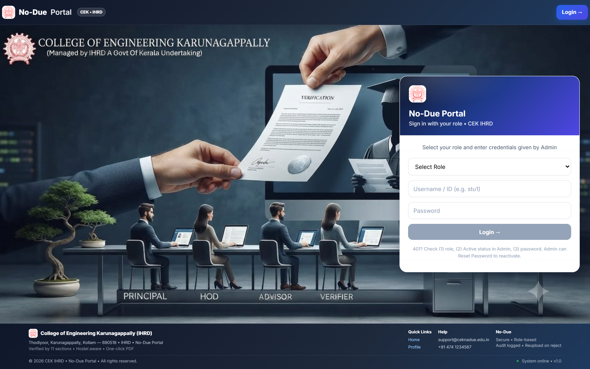
*Login page*

### Student
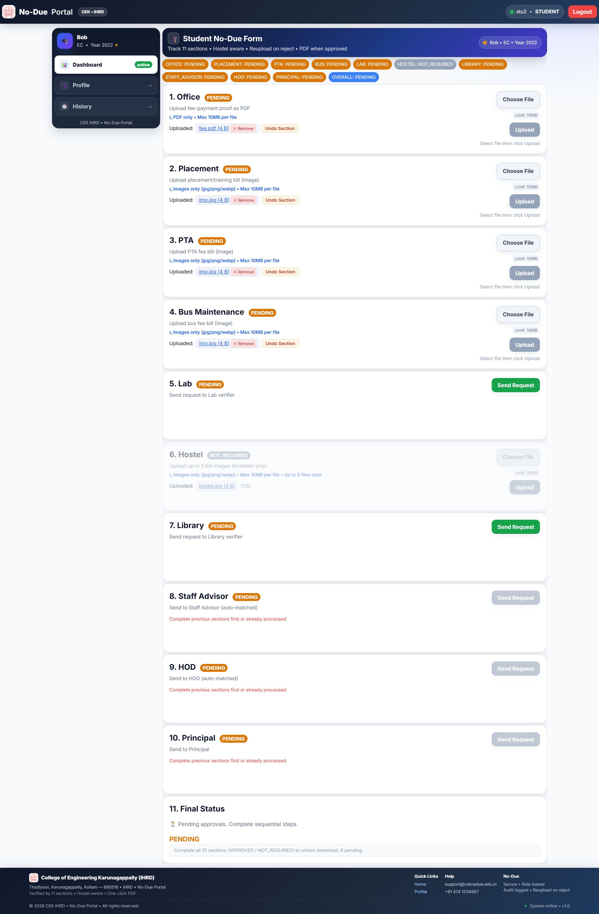
*Student dashboard — pending sections*

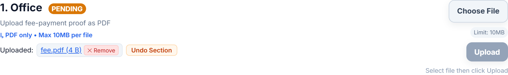
*Office PDF upload*

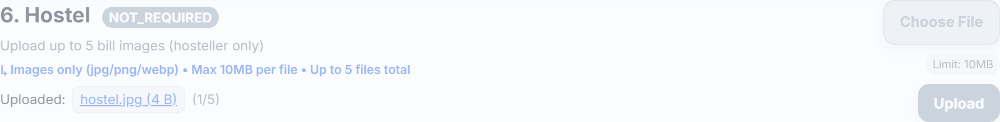
*Hostel multi-image upload*

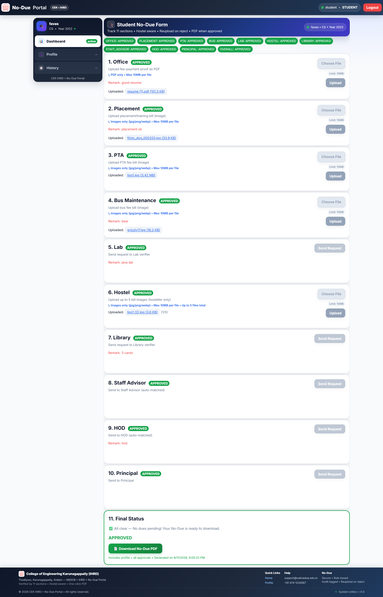
*All sections approved*

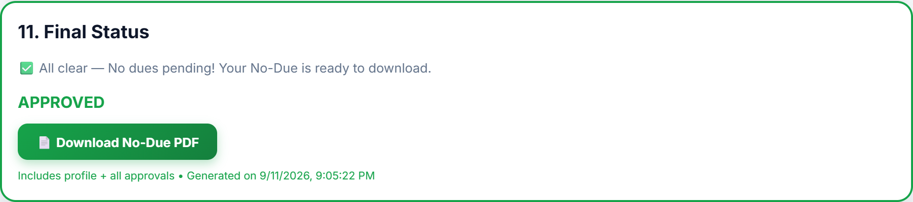
*Final status card*

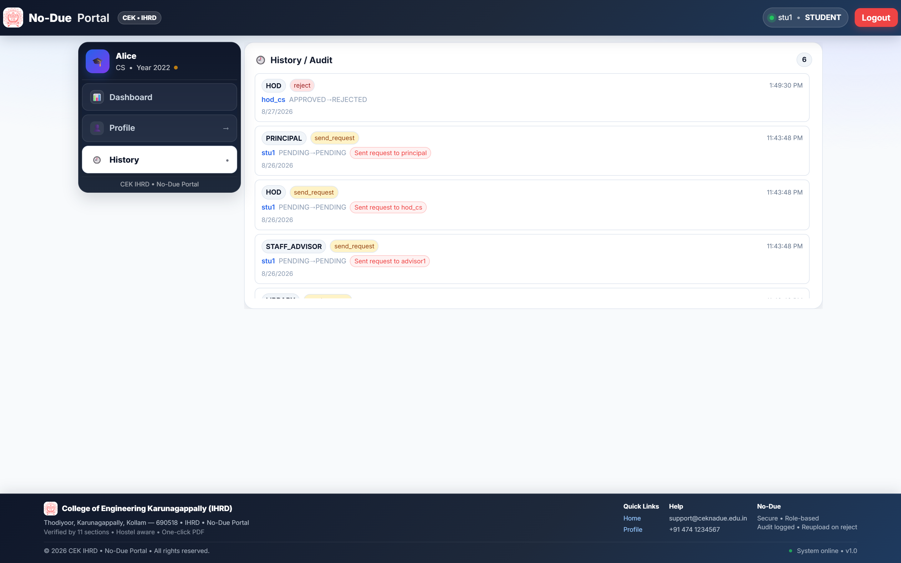
*Audit history*

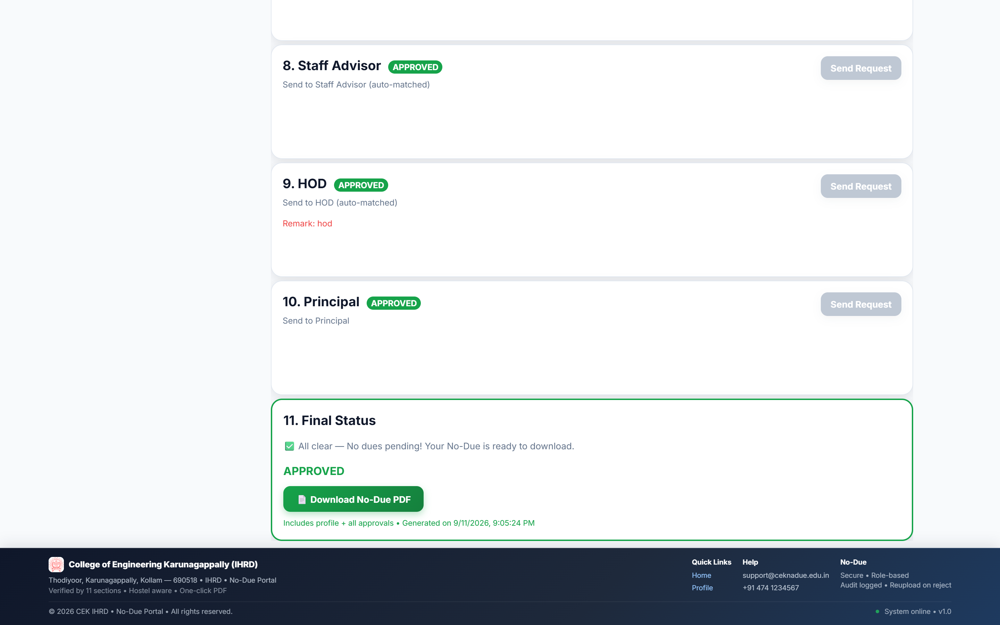
*No-Due certificate preview*

### Verifier

*Verifier inbox (Office)*


*Request detail with approve / reject*

### Staff / HOD / Principal

*Staff Advisor dashboard*
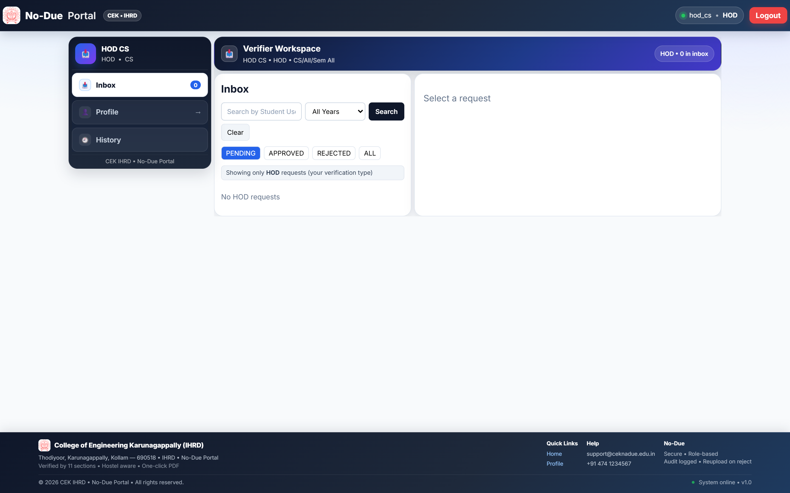
*HOD dashboard*
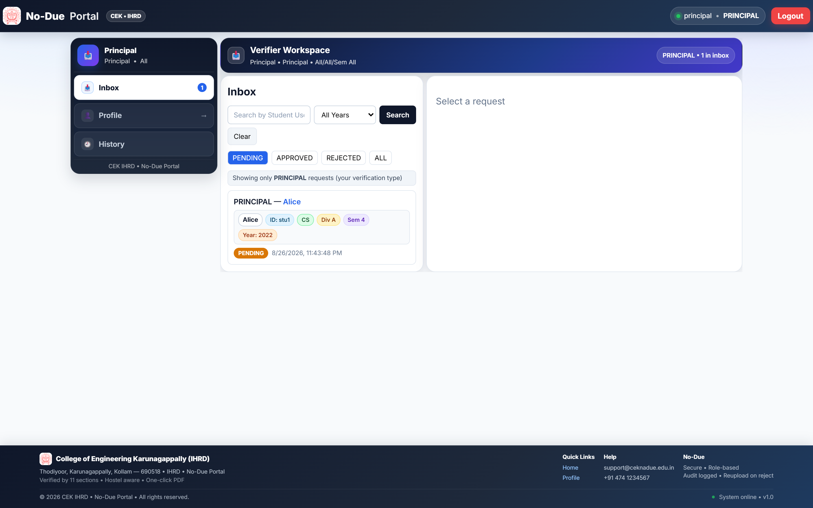
*Principal dashboard*

### Admin
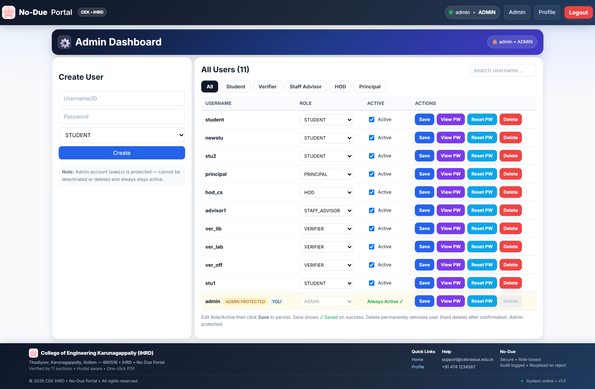
*Admin dashboard*

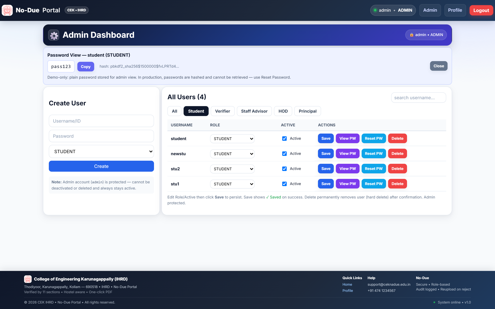
*Admin role filters*

### Mobile
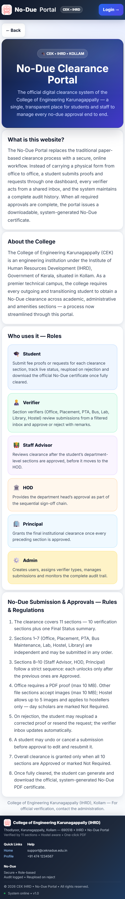
*Responsive landing*

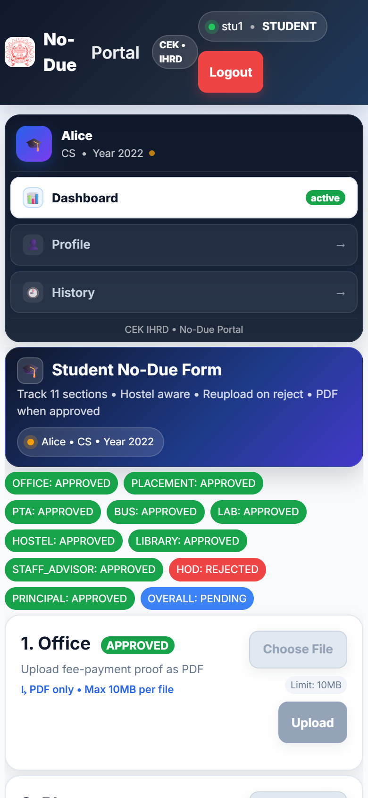
*Mobile student dashboard*

## Demo / Video

GitHub does not render `.webm` inline, so the screen recordings are provided as repository-relative links:

- [video_01_complete_ui_tour.webm](captures/recordings/video_01_complete_ui_tour.webm) — complete UI tour
- [video_02_student_experience.webm](captures/recordings/video_02_student_experience.webm) — student experience
- [video_03_verifier_review_workflow.webm](captures/recordings/video_03_verifier_review_workflow.webm) — verifier review workflow
- [video_04_admin_user_management.webm](captures/recordings/video_04_admin_user_management.webm) — admin user management
- [video_05_clearance_and_certificate_download.webm](captures/recordings/video_05_clearance_and_certificate_download.webm) — clearance & certificate download

## Core Capabilities

- JWT-based authentication
- Role-based access for `ADMIN`, `STUDENT`, `VERIFIER`, `STAFF_ADVISOR`, `HOD`, and `PRINCIPAL`
- Student profile management
- Sequential 11-section clearance workflow
- Role-aware verification inboxes
- Approve/reject actions with remarks and timestamps
- Automatic request routing by department, division, semester, and verifier type
- File uploads with section-specific validation
- Audit history for submissions and verification activity
- Administrative user, submission, request, and verification-type management

## Clearance Workflow

1. Office — PDF
2. Placement — image
3. PTA — image
4. Bus / Bus Maintenance — image
5. Lab — verification request
6. Hostel — up to 5 images for hostellers; not required for day scholars
7. Library — verification request
8. Staff Advisor — enabled after sections 1–7 are approved
9. HOD — enabled after sections 1–8 are approved
10. Principal — enabled after sections 1–9 are approved
11. Final status — approved only when all required sections are approved

Sequential enforcement is implemented in `submissions/utils.py`, with `find_assignee()` handling automatic routing.

## Tech Stack

- **Backend:** Django 6, Django REST Framework, SimpleJWT, Pillow
- **Frontend:** React, Vite, React Router, Axios
- **Database:** SQLite for the current repository setup
- **Security:** JWT authentication, Django password hashing, environment-based configuration, upload validation

## Project Structure

```text
no_due/
├── backend/
│   ├── config/            # Settings, URLs and WSGI configuration
│   ├── accounts/          # Users, profiles, authentication and admin APIs
│   ├── submissions/       # 11-section workflow, uploads and audit logs
│   ├── verification/      # Verification inbox and approve/reject actions
│   ├── manage.py
│   └── requirements.txt
├── frontend/              # React + Vite application
├── docs/                  # Setup and architecture documentation
├── manage.py              # Root management shim
└── requirements.txt       # Root dependency shim
```

## Local Setup

### Backend

```bash
cd backend
python -m venv .venv
# Windows: .venv\\Scripts\\activate
# macOS/Linux: source .venv/bin/activate
pip install -r requirements.txt
cp .env.example .env
python manage.py migrate
python manage.py runserver
```

### Frontend

```bash
cd frontend
npm install
npm run dev
```

Production frontend builds can be generated with:

```bash
npm run build
```

See `docs/SETUP.md` and `docs/ARCHITECTURE.md` for repository-specific setup and architecture guidance.

## API Overview

```text
POST /api/auth/login/
POST /api/auth/refresh/
GET  /api/auth/me/
GET/POST/PUT /api/profile/
GET  /api/submissions/my/
POST /api/submissions/upload/<SECTION>/
POST /api/submissions/request/<SECTION>/
GET  /api/submissions/audit/
GET  /api/verification/inbox/
GET  /api/verification/request/<id>/
POST /api/verification/request/<id>/action/
```

## File Upload Security

The application applies a 10 MB upload limit, extension/content-type validation, section-specific rules, and dated upload paths. Supported document/image requirements vary by clearance section.

## Configuration & Security Notes

Environment-specific values are expected in `.env` files that are excluded from version control. Do not commit production secrets, real user credentials, or private uploaded files.

For production deployment, review `DEBUG`, CORS, allowed hosts, secret-key configuration, database configuration, and media storage before exposing the service publicly.

## Project Status

The repository contains the backend, frontend, workflow logic, documentation, and role-specific interfaces needed for the current clearance workflow. Production hardening and deployment configuration should be completed separately for the target institution.

## License

No license file is currently defined in the repository. Please contact the repository owner for reuse or licensing questions.
